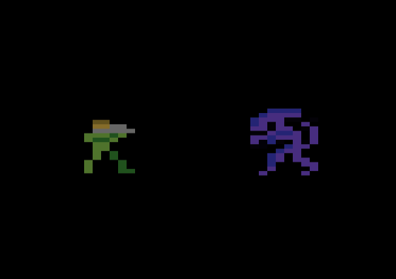

# Every Meal A Banquet, Every Paycheck A Fortune

This is still a work-in-progress!!!

Play it in your browser:

https://javatari.org?ROM=https://github.com/dmanning23/aliens2600/releases/download/v0.1/Aliens2600.bin

Check the Releases page for the latest version:
https://github.com/dmanning23/aliens2600/releases

### How to play

Explore the colony on LV4-2600

Avoid Xenomorphs (or shoot the shit out of them)

Rescue Newt

Defeat the Xenomorph Queen

Get back to the dropship before the colony asplode

Punch-Out in the landing bay: Loader Vs Queen!

### Controls

Player 1 (Marine):
| Action        | Result  |
|:------------- | -----:|
| Left      | Move left |
| Right      | Move right |
| Up      | Move up |
| Down      | Move up NO I mean move down |
| Button | Fire Pulse Rifle |

Player 2 (Xenomorph):
| Action        | Result  |
|:------------- | -----:|
| Left      | Move left |
| Right      | Move right |
| Up      | Move up |
| Down      | Move down |
| Button | ??? |
| Power Switch | How can they cut the power, man? They're animals! |

